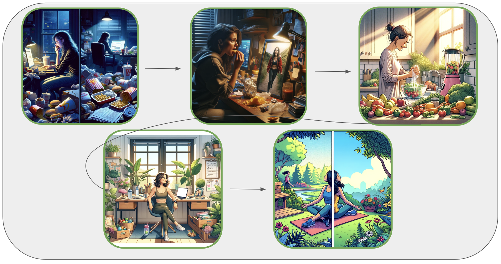
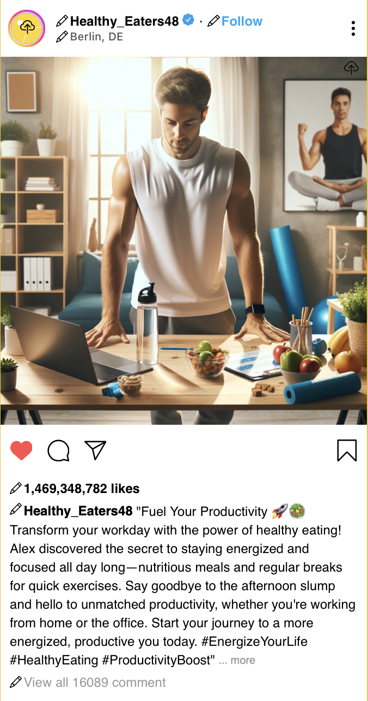

# HealthyEating
Let's check out some AI designed media promoting Healthy Eating!

## First, we’re going to focus on a video, but due to lack of AI video generation, I split it up into more of a comic strip. Here is a description of how the process went with the AI along with the finished product.
Initially, I encountered challenges in crafting that impactful marketing punchline or reasoning meant to draw consumers in; the approach was more about getting straight to the point. I chose my topic and then asked GPT to devise a niche marketing idea for a comic strip that would highlight the gain framework. It proposed a plot centered around the irregularities in healthy eating due to remote working, which I thought was pretty good. Subsequently, it generated its own descriptions to feed into Dall-E, aiming to create the most consistent and coherent product possible. Despite its efforts, it struggled to deliver a decisive moment that consumers could truly resonate with, resulting in a more generalized outcome.

I started over and explicitly directed it to achieve what it previously hadn’t —- craft a narrative that conveyed the message more smoothly and naturally. This necessitated multiple restarts, especially when the iterations seemed to diminish in quality. Whenever the results were unsatisfactory, I would push for improvements, prompting it to refine the descriptions it provided to Dall-E. Remarkably, GPT-4 continued to supply Dall-E with developed descriptions for the imagery, sparking curiosity about its ability to maintain consistency, whether in backdrops or the depiction of the character Alex across the frames.

Overall, while the message does get across, it does so in a manner distinct from human storytelling, both in terms of consistency and the ability to resonate with the audience.

Chat’s descriptors were:

Panel 1: The Overwhelmed Beginning Refined Detailed Description for DALL-E:

Create an image that captures Alex in a moment of overwhelm and unhealthiness. She is sitting in a dark, cluttered room late at night, the only light coming from her computer screen. Surrounded by fast food containers and looking visibly stressed and tired, the scene should emphasize a lifestyle in dire need of change. The environment is chaotic, filled with work papers, empty coffee cups, and unhealthy snacks, symbolizing a neglect of personal well-being for work.

Panel 2: The Moment of Realization Simplified Detailed Description for DALL-E:

Envision an image where Alex is caught in a moment of poignant reflection. She’s seated at her cluttered desk, with an unhealthy snack half-raised to her mouth, but her attention is diverted. She’s looking at an old photograph of herself, displayed prominently on the desk, showing her in a moment of joy and activity—perhaps hiking or laughing with friends in a park. The contrast is stark: the vibrant, happy person in the photo versus Alex’s current, more subdued and unhealthy appearance. The lighting should emphasize the photo as a beacon of hope and realization in the dimly lit room, drawing Alex’s gaze and stirring a deep desire for change. This powerful moment is the catalyst for her journey towards a healthier lifestyle, captured with a blend of nostalgia and determination in Alex’s expression.

Panel 3: Embracing Change Refined Description for DALL-E:

Create an image showing Alex in a moment of positive action. She has transformed part of her living space into a bright, inviting area for meal preparation. The kitchen counter is now clean and organized, adorned with fresh fruits, vegetables, and a blender for making smoothies. Alex, with a look of determination and joy, is washing vegetables or preparing a salad, symbolizing her commitment to change. The scene is lit by natural light streaming through a window, reflecting a new dawn or a fresh start in her life. This panel illustrates the tangible steps Alex is taking towards reclaiming her health and wellness, setting a hopeful and motivating tone for her journey.

Panel 4: Discovering a New Routine Refined Description for DALL-E:

Create an image depicting Alex’s new and improved daily routine. She’s in her home office, which is now a model of organization and vibrancy. The space is filled with plants, symbolizing growth and vitality, and the desk showcases a healthy work-life balance: a laptop, a water bottle, healthy snacks, and a planner with reminders for short breaks and exercise. Alex is sitting confidently, looking relaxed and content, embodying the positive impacts of her lifestyle change. The room has large windows that let in plenty of natural light, further emphasizing a connection to wellness and the outside world. This panel celebrates Alex’s successful integration of health into her life, showing her happier, more productive, and balanced.

Panel 5: The Rewarding Outcome Refined Description for DALL-E:

Create an image that shows Alex enjoying the rewards of her healthier lifestyle outside of her work environment. Picture her in a serene outdoor setting, such as a garden or a park, taking a leisurely break or engaging in a physical activity she enjoys, like yoga or jogging. She looks radiant and full of energy, a stark contrast to the first panel. The setting is vibrant, with lush greenery and a clear blue sky, symbolizing her reconnection with nature and personal well-being. This scene is not just a celebration of her physical transformation but also her mental and emotional rejuvenation. Alex is not alone; she’s either with friends or a pet, indicating an improvement in her social life and emotional connections.

Next, I wanted to generate a social media post that utlizes the Gain/Loss framework. I wanted this to essentially simulate what a two-picture Instagram post might be like.
## First results with minimal intervention by myself: 
Gain Framed Post:
Visual:

An uplifting image of Alex enjoying her new lifestyle—doing yoga in her bright, clean room with her work station neatly organized in the background, symbolizing balance and well-being.

Text:

"Transform Your Life Today! 🌟 Embrace a healthier lifestyle like Alex and discover a world of benefits. Increased energy, better focus, and a happier you await. It's not just about living longer; it's about living better. #HealthTransformation #LiveWell #NewBeginnings"

Loss Framed Post:
Visual:

A contrasting image of Alex looking overwhelmed and tired in her cluttered, dark workspace, surrounded by unhealthy snacks, symbolizing the negative impact of neglecting health.

Text:

"Don't Let Your Habits Control You. 😔 Ignoring your health can lead to decreased energy, lower productivity, and a diminished quality of life. It's time to break the cycle and take the first step towards a better you. #TakeControl #HealthyChange #ActNow"

*I wanted it to be more direct and specific, rather than kind of just suggesting that healthy eating leads to better lifestyle. Within my next prompt, I again said, "Make a real reason that viewers can resonate with."*

## Updated Results
Revised Gain Framed Post:
Visual:

An engaging image showing Alex in her home office, which doubles as a workout space. She's visibly energized, standing at her desk, working efficiently, with healthy snacks and a water bottle within reach. The background includes a yoga mat and some fitness equipment, indicating her active lifestyle. This scene illustrates the direct link between healthy eating, increased energy levels, and productivity.

*I think that this will do a better job in directly addressing a common challenge in a sort of actionable way. Let's See:*

It's AI, so obviously it won't be perfect, and perhaps it cannot appeal to human emotion nearly as well as another human, and especially a marketing focused person. Still, I think it does a pretty good job using the gain framework to produce a post which exemplifies how healthy eating could help with the "afternoon slump."
